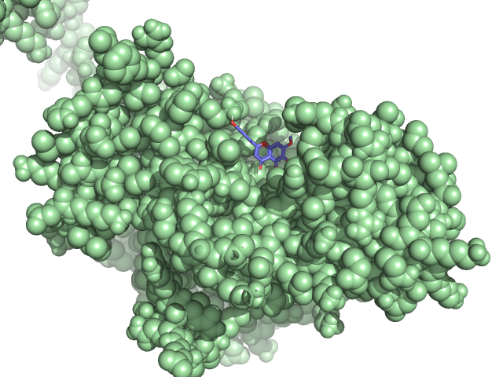

# Stage3 Phase 1
## Molecular Docking of LDHA Protein with Artemisia annua Phytochemicals
### Intro
Lung cancer is one of the most common and serious types of cancer. Lung cancer starts in the windpipe(trachea), the main airway (bronchus) or the lung tissue. Most lung cancers are caused as a result of smoking and non-smokers can also develop lung cancer.
Lactate dehydrogenase A (LDHA) catalyzes the conversion of pyruvate to lactate, and its abnormal expression and activation have been strongly linked to various cancers(Tjokrowidjaja et al., 2022). LDHA is located in the cytoplasm. Inhibition of LDHA is known to reduce migration of cancer cells, invasion and cancer metastasis (Feng et al., 2018).

### Curated phytochemical library
Using PubChem we selected <a href='images/Metabolites.docx'>50 phytochemicals</a> from Artemisia annua, a medicinal plant renowned for its medicinal properties, including potential cancer-preventive benefits(Lang et al., 2019).

### Methodology
#### Protein Structure Acquisition  
The 3-dimensional structure of LDHA was predicted and downloaded in PDB format through AlphaFold proceeding towards molecular docking purposes.
<image src="images/LDHA.png">
#### Identification of Active Site  
Potential active sites of LDHA were identified using Fpocket revolving the regions that interact with inhibitors. PyMOL was used afterwards for visualizations.
<image src="images/LDHA_active_site.png">
#### Phytochemical Preparation  
The 3D structures of curated phytochemicals were downloaded in SDF format from PubChem, marged through Open Babel, and delivered into PyRx to initiate molecular docking. 
#### Molecular Docking using PyRx  
The molecular docking was done in PyRx. The steps involved are as follows:  
Preparation of Proteins: The water molecules were removed from the LDHA structure, adding hydrogen atoms and charges.  
Definition of the Active Site: A grid box of 40 Å × 40 Å × 40 Å was set around the identified active site of LDHA.  
Ligand-Receptor Interaction: The active site was used for the docking of each phytochemical using PyRx, with an exhaustiveness of 8 to ensure extensive examination of the search space. For each ligand, ten binding modes were generated.  

Binding Affinity Measurement: The result from docking was ranked by their calculated free energy of binding (ΔG), whereby the interactions are stronger with lower ΔG values.
### Results  
#### Binding Affinities  
The docking simulations generated 5 notable compounds displaying the highest predicting binding affinities to LDHA. 

Eupartin: ΔG = -7.5 kcal/mol  
Quercetin: ΔG = -7.4 kcal/mol  
kaempferol: ΔG = -7.4 kcal/mol  
cirsimaritin: ΔG = -7.4 kcal/mol  
arcapillin : ΔG = -7.4 kcal/mol  
All results are available in this <a href='images/LDHA_binding.csv'> Excel </a> file.
#### Pipeline Reusability and Possible Applications  
The pipeline reusability accounts for the virtual screening of other phytochemical libraries against any cancer-related protein. The general protocol adopted includes: 
     Protein structure prediction 
     Ligand preparation 
     Transparent docking via PyRx 
The natural phytochemicals identified with high binding affinities for LDHA present promising opportunities in the quest for the discovery of anticancer drugs.  
Future applications of this pipeline could include:  
• Screening of synthetic chemical libraries for the discovery of potent inhibitors of LDHA
• Virtual screening against other targets implicated in lung cancers or other cancers.  
• In vitro and in vivo validation of the best hits for anticancer activities.  

### Conclusion
The docking analysis showed that Eupartin is the most significant phytochemical with high binding affinities, having the potential to inhibit LDHA.
### References
Feng, Y., Xiong, Y., Qiao, T., Li, X., Jia, L., & Han, Y. (2018). Lactate dehydrogenase A: A key player in carcinogenesis and a potential target in cancer therapy. Cancer Medicine, 7(12), 6124–6136. https://doi.org/10.1002/cam4.1820
Lang, S. J., Schmiech, M., Hafner, S., Paetz, C., Steinborn, C., Huber, R., El Gaafary, M., Werner, K., Schmidt, C. Q., Syrovets, T., & Simmet, T. (2019). Antitumor activity of an Artemisia annua herbal preparation and identification of active ingredients. Phytomedicine, 62, 152962. https://doi.org/10.1016/j.phymed.2019.152962
Tjokrowidjaja, A., Lord, S. J., John, T., Lewis, C. R., Kok, P. S., Marschner, I. C., & Lee, C. K. (2022). Pre‐ and on‐treatment lactate dehydrogenase as a prognostic and predictive biomarker in advanced non–small cell lung cancer. Cancer, 128(8), 1574–1583. https://doi.org/10.1002/cncr.34113
Miao, P., Sheng, S., Sun, X., Liu, J., & Huang, G. (2013). Lactate dehydrogenase in cancer: A promising target for diagnosis and therapy. IUBMB Life, 65(11), 904–910. https://doi.org/10.1002/iub.1216

# Stage 3 Phase 2

### Introduction
Bioactive agents are distinctive molecular substances that greatly influence the pathways and  expression responsible for malignancy and other diseases. Expressions of LDHA indicate the presence of multiple cancer types. Hence this report represents a comprehensive overview on identifying bioactivity against the drug target LDHA (lactate dehydrogenase A) through building a machine-learning pipeline. 
### Summary of Primary Functions and Core Features of the Dataset
A dataset consisting of 1107 bioactivity inputs from Homo sapiens was obtained from the ChEMBL database, specifically targeting LDHA. Two key features, SMILES (Simplified Molecular Input Line Entry System) and IC50 values (which measure bioactivity), were used to filter out missing and duplicate entries. After this filtration process, the dataset was reduced to 525 entries. The dataset was analyzed based on the following Lipinski Descriptors, which are important for determining drug-likeness:
•	Molecular weight < 500 Dalton
•	SMILES format
•	Octanol-water partition coefficient (LogP) < 5
•	Hydrogen bond donors < 5
•	Hydrogen bond acceptors < 10
The IC50 values, which represent how effectively a compound inhibits the target enzyme, were used as key metrics for bioactivity assessment. These values help to evaluate the potential of compounds as drug candidates.

### Pre-processing Steps
The dataset was filtered using Lipinski Descriptors to ensure drug-likeness based on molecular weight, hydrogen bonds, and LogP. IC50 values were converted to pIC50 for easier interpretation (scaled between 2 and 10). Redundant and missing values were removed. Descriptors were concatenated to organize the data. The cleaned dataset consisted of Lipinski descriptors and pIC50 measurements. Molecules were classified based on IC50: Active (<1000), Inactive (>10000) and Intermediate (1000-10000). Other 200 descriptors were generated using the Padel script. The dataset was split into 80% for training and 20% for testing.

### Training and Testing
A Random Forest Regressor was used as a machine-learning model. The model combines subsets of data trees to improve prediction accuracy. 
The model has been trained on 80% of the dataset. The descriptors were given to the model as the features (x) and IC50 as the output (y).
Evaluation metrics:
•	R-squared: 0.7780, indicating strong correlation between training and testing sets.
•	Mean Squared Error (MSE): 0.4803, representing squared differences between predicted and actual values.
•	Median Absolute Error (MedAE): 0.3760, showing the median magnitude of errors in the predicted values 
### Feature Importance
The most important features were molecular weight, hydrogen bond donors and acceptors, and LogP. These descriptors provided insight into how the bioactive agents interacted with LDHA receptors. Compounds with lower molecular weights and fewer hydrogen bonds generally exhibited higher potency and better binding to the target. LogP values measured the solubility of compounds, with higher values indicating better bioavailability.
### Conclusion
The machine learning model successfully predicted bioactivity against LDHA. Key molecular descriptors played a significant role in improving the drug discovery process by identifying potential bioactive compounds.

